```mermaid
sequenceDiagram
    participant User
    participant NLP as NLP Handler
    participant Wrapper as EMBOSS Wrapper
    participant Ensembl as Ensembl API
    participant UCSC as UCSC REST API

    User->>NLP: "What genes neighbor CARS1?"
    NLP->>NLP: Parse → find_neighboring_genes
    NLP->>Wrapper: tool='find_neighboring_genes'<br/>gene_name='CARS1', genome='hg38'
    
    Wrapper->>Ensembl: GET /lookup/symbol/homo_sapiens/CARS1
    Ensembl->>Wrapper: chr11:3,011,986-3,051,922<br/>26 transcripts
    
    Note over Wrapper: Expand region ±500kb
    Wrapper->>UCSC: GET /getData/track?genome=hg38<br/>&track=knownGene<br/>&chrom=chr11<br/>&start=2511986&end=3551922
    
    UCSC->>Wrapper: 47 gene annotations
    
    Note over Wrapper: Filter & process
    Wrapper->>Wrapper: 1. Filter: geneType=='protein_coding'<br/>2. Calculate distances from CARS1<br/>3. Find closest left & right<br/>4. Deduplicate by gene symbol
    
    Wrapper->>User: LEFT: NAP1L4 (~8,536 bp)<br/>RIGHT: OSBPL5 (~29,493 bp)<br/>Plus top 5 each side with distances
```

# BioQuery Local - Architecture & Flow Diagrams

## System Architecture Overview


## Natural Language Query Flow - Cloud & Local Modes

```mermaid
graph TB
    A["User Query<br/>e.g., 'Characterize mystery sequence'"] -->|Send to NLP| B{Mode<br/>Selection}
    
    B -->|Cloud Mode| C["Google Gemini<br/>2.5 Flash"]
    B -->|Local Mode| D["Ollama<br/>gemma3:4b"]
    
    C -->|Parse with System Prompt| E{Safety<br/>Filter?}
    E -->|Blocked| F["⚠️ Fallback to Ollama<br/>(Cloud features remain active)"]
    E -->|Approved| G["Gemini Processing"]
    
    F -->|Process Query| H{Query Type?}
    G -->|Parse Query| H
    D -->|Parse Query| H
    
    H -->|Characterize/Mystery| I["Multi-Step Workflow:<br/>1. BLAT - map to genome<br/>2. ucsc_table - gene overlaps<br/>3. BLAST - RNA database search"]
    H -->|Gene Query| J["→ gene_query tool<br/>gene_name: ALKBH1"]
    H -->|EMBOSS Tool| K["→ translate tool<br/>gene_name: ALKBH1"]
    H -->|Neighboring Genes| L["→ find_neighboring_genes<br/>gene_name: CARS1"]
    H -->|Genome Region| M["→ genome_query<br/>chrom, start, end"]
    H -->|Raw Sequence| N["→ tool<br/>sequence: ATGC..."]
    H -->|BLAST Search| O["→ blast/blastn/blastp<br/>exclude_taxa, organism, etc."]
    
    I -->|Return Steps JSON| P["Tool + Parameters"]
    J -->|Return JSON| P
    K -->|Return JSON| P
    L -->|Return JSON| P
    M -->|Return JSON| P
    N -->|Return JSON| P
    O -->|Return JSON| P
    
    P -->|Pass to EMBOSS Wrapper| Q["Execute Operation(s)"]
    
    style A fill:#1565c0,stroke:#0d47a1,color:#ffffff,font-weight:bold
    style B fill:#ff6f00,stroke:#e65100,color:#ffffff,font-weight:bold
    style C fill:#4caf50,stroke:#2e7d32,color:#ffffff,font-weight:bold
    style D fill:#9c27b0,stroke:#6a1b9a,color:#ffffff,font-weight:bold
    style E fill:#f57f17,stroke:#e65100,color:#ffffff,font-weight:bold
    style F fill:#ff9800,stroke:#e65100,color:#ffffff,font-weight:bold
    style G fill:#4caf50,stroke:#2e7d32,color:#ffffff,font-weight:bold
    style H fill:#f57f17,stroke:#e65100,color:#ffffff,font-weight:bold
    style I fill:#e91e63,stroke:#c2185b,color:#ffffff,font-weight:bold
    style J fill:#2e7d32,stroke:#1b5e20,color:#ffffff,font-weight:bold
    style K fill:#2e7d32,stroke:#1b5e20,color:#ffffff,font-weight:bold
    style L fill:#1976d2,stroke:#0d47a1,color:#ffffff,font-weight:bold
    style M fill:#2e7d32,stroke:#1b5e20,color:#ffffff,font-weight:bold
    style N fill:#2e7d32,stroke:#1b5e20,color:#ffffff,font-weight:bold
    style O fill:#00acc1,stroke:#00838f,color:#ffffff,font-weight:bold
    style P fill:#00695c,stroke:#004d40,color:#ffffff,font-weight:bold
    style Q fill:#6a1b9a,stroke:#4a148c,color:#ffffff,font-weight:bold
```



## Mystery Sequence Characterization Workflow (NEW)


## Neighboring Genes Discovery Flow (NEW)


graph TD
    A["User: 'Translate CARS1<br/>transcript variant 5'"] 
    
    A -->|NLP Parsing| B["Identified:<br/>tool: translate<br/>gene_name: CARS1<br/>transcript_variant: 5"]
    
    B -->|Pass to run_tool| C["EMBOSS Wrapper<br/>run_tool()"]
    
    C -->|Query Gene Info| D["Ensembl API<br/>query_gene_info"]
    D -->|Returns 26 Transcripts| E["Find Transcript 5<br/>ENST00000380525"]
    
    E -->|Fetch CDS| F["get_transcript_sequence<br/>seq_type='cds'<br/>Result: 2496 bp"]
    
    F -->|Translate to Protein| G["translate_sequence<br/>frame=1"]
    G -->|EMBOSS transeq| H["Output: 832 aa<br/>Last 3: FQ*"]
    
    H -->|Format Result| I["Gene CARS1 from transcript variant 5:<br/>Protein Length: 832 aa<br/>Last 3 aa: FQ*"]
    
    I -->|Return to User| J["Display in Streamlit"]
    
    style A fill:#1565c0,stroke:#0d47a1,color:#ffffff,font-weight:bold
    style B fill:#f57f17,stroke:#e65100,color:#ffffff,font-weight:bold
    style C fill:#6a1b9a,stroke:#4a148c,color:#ffffff,font-weight:bold
    style D fill:#2e7d32,stroke:#1b5e20,color:#ffffff,font-weight:bold
    style E fill:#00695c,stroke:#004d40,color:#ffffff,font-weight:bold
    style F fill:#c62828,stroke:#b71c1c,color:#ffffff,font-weight:bold
    style G fill:#5e35b1,stroke:#3f51b5,color:#ffffff,font-weight:bold
    style H fill:#2e7d32,stroke:#1b5e20,color:#ffffff,font-weight:bold
    style I fill:#00695c,stroke:#004d40,color:#ffffff,font-weight:bold
    style J fill:#1565c0,stroke:#0d47a1,color:#ffffff,font-weight:bold
```

## Neighboring Genes Discovery Flow (NEW)


## Mystery Sequence Characterization Workflow (NEW)


## EMBOSS Tool Resolution


## Streamlit App Tab Flow


## Command Logging System Flow (NEW)


## Data Flow: Gene Query to Result


## Key Features at a Glance


## Safety Filter Handling & Ollama Fallback (NEW)

```mermaid
graph TB
    A["User Query:<br/>'BLAST FBL mRNA excluding primates'"]
    
    A -->|Send to Cloud Mode| B["NLP Handler<br/>(Cloud Mode Active)"]
    
    B -->|Try Gemini First| C["Google Gemini 2.5 Flash"]
    
    C -->|Process Query| D{Safety<br/>Filter<br/>Triggered?}
    
    D -->|BLOCKED| E["⚠️ Safety filter detected:<br/>- Genetic sequences<br/>- Scientific terminology<br/>- Domain/taxonomy terms"]
    
    E -->|Auto-Fallback| F["Switch to Ollama<br/>(gemma3:4b)<br/>Cloud features remain active"]
    
    F -->|Reprocess Query| G["Ollama Processing<br/>No content restrictions"]
    
    D -->|APPROVED| H["Gemini Processing"]
    
    G -->|Parse Query| I["Extract Parameters:<br/>tool: blastn<br/>exclude_taxa: primates<br/>database: nt"]
    
    H -->|Parse Query| I
    
    I -->|Execute| J["BLAST Search<br/>with filters applied"]
    
    J -->|Results sorted by bit score| K["Display Results"]
    
    Note over F: Cloud features still work:<br/>- gene_query<br/>- genome_query<br/>- BLAST<br/>- GTEx<br/>- PubMed
    
    style A fill:#1565c0,stroke:#0d47a1,color:#ffffff,font-weight:bold
    style B fill:#4caf50,stroke:#2e7d32,color:#ffffff,font-weight:bold
    style C fill:#4caf50,stroke:#2e7d32,color:#ffffff,font-weight:bold
    style D fill:#f57f17,stroke:#e65100,color:#ffffff,font-weight:bold
    style E fill:#d32f2f,stroke:#b71c1c,color:#ffffff,font-weight:bold
    style F fill:#9c27b0,stroke:#6a1b9a,color:#ffffff,font-weight:bold
    style G fill:#9c27b0,stroke:#6a1b9a,color:#ffffff,font-weight:bold
    style H fill:#4caf50,stroke:#2e7d32,color:#ffffff,font-weight:bold
    style I fill:#00695c,stroke:#004d40,color:#ffffff,font-weight:bold
    style J fill:#00acc1,stroke:#00838f,color:#ffffff,font-weight:bold
    style K fill:#1565c0,stroke:#0d47a1,color:#ffffff,font-weight:bold
```


## File Structure


## Technology Stack - Enhanced v3.0


