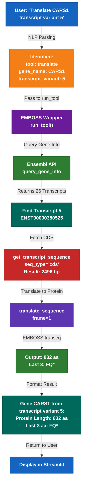
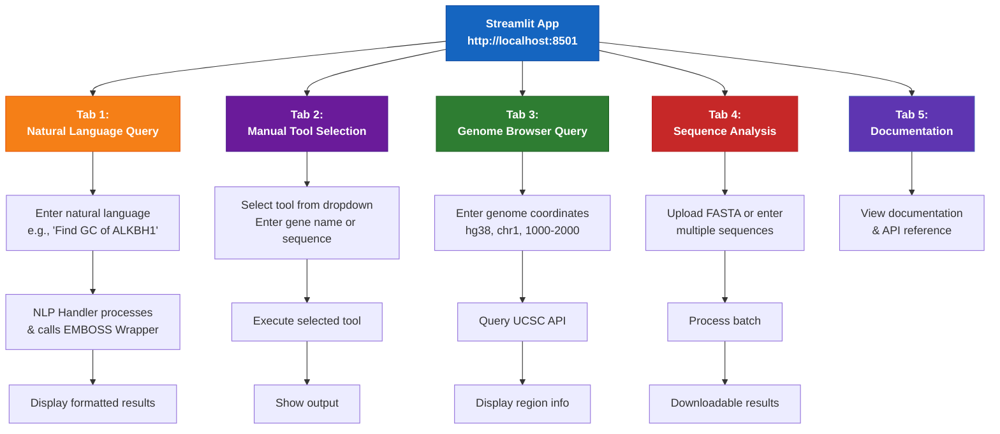
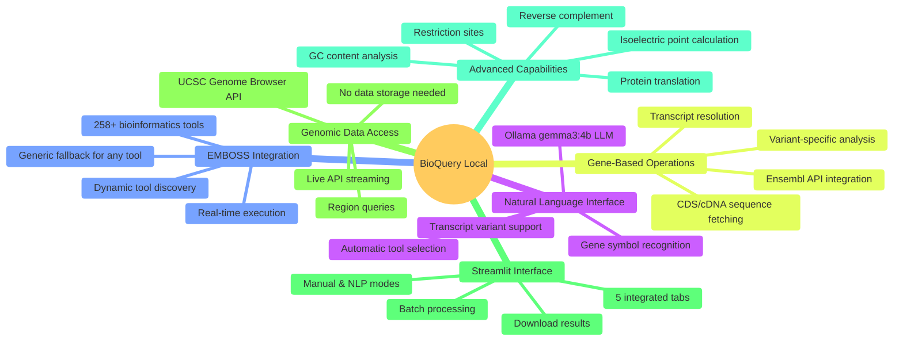
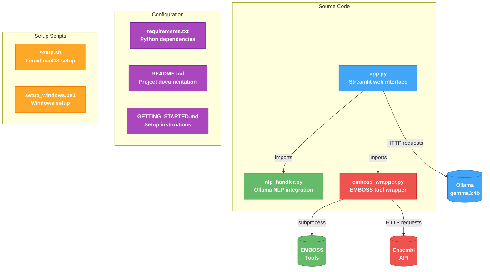
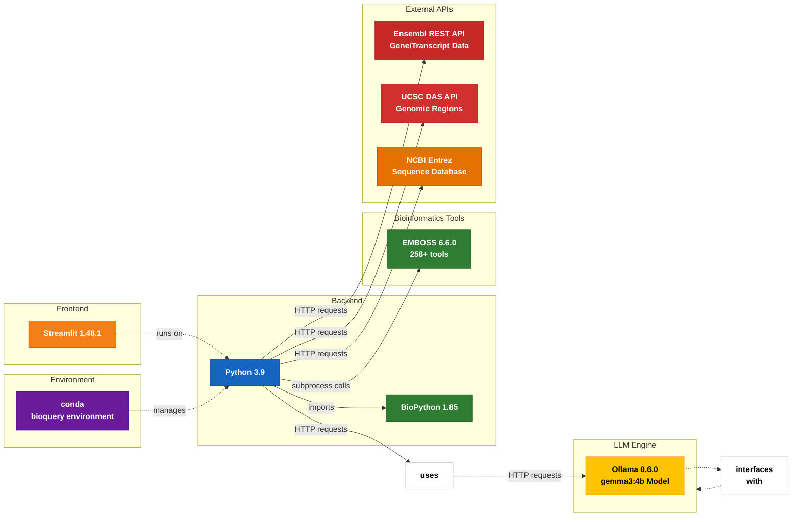

# BioQuery Local - Architecture & Flow Diagrams

## System Architecture Overview

```mermaid
graph TD
    UI["🌐 Streamlit Web App<br/>http://localhost:8501"]
    
    subgraph Frontend["Frontend Layer"]
        NLP["NLP Handler<br/>(nlp_handler.py)<br/>Ollama gemma3:4b"]
        ManualTool["Manual Tool Selection"]
    end
    
    subgraph Backend["Backend Processing"]
        Wrapper["EMBOSS Wrapper<br/>(emboss_wrapper.py)<br/>258+ tools"]
        GeneResolver["Gene Symbol Resolver<br/>Ensembl API"]
        TranscriptFetcher["Transcript Fetcher<br/>Ensembl API"]
        ToolExecutor["EMBOSS Tool Executor<br/>Subprocess runner"]
    end
    
    subgraph ExternalAPIs["External Databases"]
        Ensembl["Ensembl REST API<br/>Gene/Transcript Info"]
        UCSC["UCSC Genome Browser<br/>Genomic Regions"]
        NCBI["NCBI Entrez<br/>Sequence Download"]
    end
    
    UI -->|Natural Language Query| NLP
    UI -->|Manual Input| ManualTool
    
    NLP -->|Parse Query| Wrapper
    ManualTool -->|Tool + Params| Wrapper
    
    Wrapper -->|Gene Symbol?| GeneResolver
    GeneResolver -->|Query Gene Info| Ensembl
    Ensembl -->|Transcripts & IDs| TranscriptFetcher
    TranscriptFetcher -->|Fetch Sequence| Ensembl
    
    Wrapper -->|Run EMBOSS Tool| ToolExecutor
    ToolExecutor -->|Execute| Wrapper
    
    Wrapper -->|Genomic Region?| UCSC
    Wrapper -->|Download Sequence?| NCBI
    
    Wrapper -->|Results| UI
    
    style UI fill:#1e88e5,stroke:#0d47a1,color:#ffffff,font-weight:bold
    style NLP fill:#ff6f00,stroke:#e65100,color:#ffffff,font-weight:bold
    style ManualTool fill:#7b1fa2,stroke:#4a148c,color:#ffffff,font-weight:bold
    style Wrapper fill:#388e3c,stroke:#1b5e20,color:#ffffff,font-weight:bold
    style GeneResolver fill:#0097a7,stroke:#006064,color:#ffffff,font-weight:bold
    style TranscriptFetcher fill:#00838f,stroke:#004d40,color:#ffffff,font-weight:bold
    style ToolExecutor fill:#00796b,stroke:#004d40,color:#ffffff,font-weight:bold
    style Ensembl fill:#d32f2f,stroke:#b71c1c,color:#ffffff,font-weight:bold
    style UCSC fill:#f57c00,stroke:#e65100,color:#ffffff,font-weight:bold
    style NCBI fill:#fbc02d,stroke:#f57f17,color:#000000,font-weight:bold
```

## Natural Language Query Flow

```mermaid
graph LR
    A["User Query<br/>e.g., 'Translate ALKBH1'"] -->|Send to Ollama| B["NLP Handler<br/>gemma3:4b Model"]
    
    B -->|Parse with System Prompt| C{Query Type?}
    
    C -->|Gene Query| D["→ gene_query tool<br/>gene_name: ALKBH1"]
    C -->|EMBOSS Tool| E["→ translate tool<br/>gene_name: ALKBH1"]
    C -->|Genome Region| F["→ genome_query<br/>chrom, start, end"]
    C -->|Raw Sequence| G["→ tool<br/>sequence: ATGC..."]
    
    D -->|Return JSON| H["Tool + Parameters"]
    E -->|Return JSON| H
    F -->|Return JSON| H
    G -->|Return JSON| H
    
    H -->|Pass to EMBOSS Wrapper| I["Execute Operation"]
    
    style A fill:#1565c0,stroke:#0d47a1,color:#ffffff,font-weight:bold
    style B fill:#1565c0,stroke:#0d47a1,color:#ffffff,font-weight:bold
    style C fill:#f57f17,stroke:#e65100,color:#ffffff,font-weight:bold
    style D fill:#2e7d32,stroke:#1b5e20,color:#ffffff,font-weight:bold
    style E fill:#2e7d32,stroke:#1b5e20,color:#ffffff,font-weight:bold
    style F fill:#2e7d32,stroke:#1b5e20,color:#ffffff,font-weight:bold
    style G fill:#2e7d32,stroke:#1b5e20,color:#ffffff,font-weight:bold
    style H fill:#00695c,stroke:#004d40,color:#ffffff,font-weight:bold
    style I fill:#6a1b9a,stroke:#4a148c,color:#ffffff,font-weight:bold
```

## Gene-Based Tool Execution Pipeline

## EMBOSS Tool Resolution

## Streamlit App Tab Flow

## Data Flow: Gene Query to Result

## Key Features at a Glance

## File Structure

## Technology Stack

